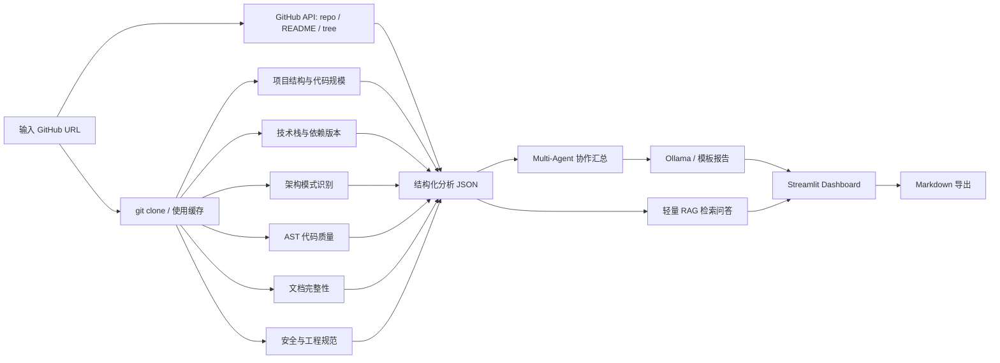

# GitHub 仓库智能分析器

一个面向课程设计答辩的 Streamlit Web Dashboard。用户输入公开 GitHub 仓库 URL 后，系统会通过 GitHub API 获取仓库元信息，再克隆仓库执行多维度确定性静态分析，最后基于结构化结果调用本地 Ollama 生成报告。它不是“把网址丢给 LLM 总结”，而是“GitHub API + 静态分析 + Multi-Agent 汇总 + RAG 问答 + LLM 报告生成”的组合式仓库洞察工具。

## 项目背景

面对陌生 GitHub 仓库，开发者通常需要快速理解项目用途、架构、技术栈、代码规模、代码质量、文档完整性、部署方式和潜在安全风险。直接让大模型总结整个仓库会遇到上下文长度限制、统计不准确、报告依据不清晰和隐私风险。本项目先用 Python 程序提取可验证指标，再让 LLM 只基于结构化结果组织报告，从而提高稳定性、可解释性和答辩可信度。

## 功能特点

- GitHub API 快照：获取仓库描述、Stars、Forks、默认分支、License、README 摘要和远程文件树统计。
- 仓库获取：输入 GitHub URL，克隆到 `data/analyzed_repos/`，支持缓存复用与重新克隆。
- 项目用途分析：从 GitHub 描述、README、topics、`package.json`/`pyproject.toml` 和技术栈中提取项目是做什么的、项目类型、目标用户和判断依据。
- 项目结构分析：统计文件数、目录数、代码行数、语言行数分布、文件类型、目录结构、最大文件和文件类别比例。
- 技术栈识别：基于 `requirements.txt`、`pyproject.toml`、`package.json`、`pom.xml`、`Dockerfile`、GitHub Actions 等文件识别语言、框架、依赖、依赖版本和工程工具。
- 架构分析：识别单体 MVC、组件化前端、标准库式分层工程、多服务候选等结构模式，输出入口文件、模块划分和判断依据。
- 代码质量分析：使用 Python `ast` 统计函数、类、平均函数长度、超长函数、超长文件、TODO/FIXME/HACK 和测试目录。
- 文档完整性检查：检查 README、安装说明、运行方式、使用示例、LICENSE、依赖文件和 `.gitignore`。
- 安全与工程规范检查：发现 `.env`、疑似 token/api_key/password/secret、虚拟环境、`node_modules`、`__pycache__` 和大文件。
- Multi-Agent 协作：架构 Agent、技术栈 Agent、代码质量 Agent、文档 Agent 和汇总 Agent 输出结构化日志、耗时和 token 估算。
- RAG 仓库问答：对 README、配置和代码片段做轻量检索，再结合 Ollama 或模板回答“怎么运行”“模型有哪些”等问题。
- LLM 报告生成：默认调用本地 Ollama `qwen2.5:7b`；如果本机只有其他模型，页面会自动列出可用模型；Ollama 不可用时自动退化为模板报告。
- Dashboard 展示：深色 SaaS 风格页面，包含指标卡、进度条、文件树、技术栈标签、文件类型图、质量评分雷达图、风险表、Agent 日志、RAG 问答和 Markdown 导出。

## 技术路线



LLM 只接收结构化分析结果或 RAG 检索到的小片段，不接收完整仓库源码。

## 项目结构

```text
github-repo-analyzer/
|-- app.py
|-- README.md
|-- requirements.txt
|-- .gitignore
|-- src/
|   |-- github_api_client.py
|   |-- project_overview_analyzer.py
|   |-- repo_loader.py
|   |-- file_tree.py
|   |-- tech_stack_detector.py
|   |-- architecture_analyzer.py
|   |-- code_quality_analyzer.py
|   |-- doc_checker.py
|   |-- security_checker.py
|   |-- agent_orchestrator.py
|   |-- rag_qa.py
|   |-- llm_reporter.py
|   `-- report_exporter.py
|-- data/
|   `-- analyzed_repos/
|-- reports/
`-- docs/
    |-- architecture_design.md
    |-- evaluation_report.md
    `-- defense_notes.md
```

## 环境配置

建议使用 Python 3.10 或更高版本。

```bash
cd github-repo-analyzer
python -m venv .venv
.venv\Scripts\activate
pip install -r requirements.txt
```

如果希望启用本地 LLM 报告，需要先安装并启动 Ollama，然后拉取模型：

```bash
ollama pull qwen2.5:7b
ollama serve
```

如果本机已有其他 Qwen 模型，例如 `qwen2.5-coder:7b`，页面会自动读取并允许选择。未安装 Ollama 或模型不可用时，系统仍会自动生成模板报告，静态分析能力不受影响。

GitHub API 未认证访问有较低限额，短时间多次分析可能出现 `rate limit exceeded`。这不会中断仓库克隆和本地静态分析；Dashboard 会显示降级提示。若希望提高 API 限额，可以在本机设置环境变量，重启 Streamlit 后生效：

```powershell
$env:GITHUB_TOKEN="你的 GitHub Personal Access Token"
streamlit run app.py
```

只分析公开仓库时 token 不需要额外权限。不要把 token 写入代码、README、`.env` 或提交到 GitHub。

## 运行方式

```bash
streamlit run app.py
```

启动后输入公开 GitHub 仓库地址，例如：

```text
https://github.com/streamlit/streamlit-hello
```

点击“开始分析”后，按钮会切换为“正在分析中...”，页面会展示 GitHub API 获取、仓库克隆、结构分析、技术栈识别、架构识别、质量评估、安全扫描、Multi-Agent 汇总和 LLM 报告生成的进度。

## 功能模块说明

### 1. GitHub API 与仓库获取

`src/github_api_client.py` 使用 GitHub API 获取仓库元信息、README 摘要和远程文件树统计。API 失败或触发限流不会中断本地分析，系统会降级为 `git clone + 本地静态分析`。如果设置了 `GITHUB_TOKEN` 或 `GH_TOKEN`，请求会自动携带认证头以提高限额。

`src/repo_loader.py` 解析 GitHub URL、校验 owner/repo、执行 `git clone --depth 1`，并将仓库保存到 `data/analyzed_repos/owner_repo/`。如果本地已有缓存，用户可以选择直接分析缓存或重新克隆。

### 2. 项目结构分析

`src/file_tree.py` 使用 `os.walk` 遍历仓库，自动忽略 `.git`、`venv`、`node_modules`、`__pycache__`、`dist`、`build` 等目录，输出文件数量、目录数量、代码行数、语言行数、扩展名统计、文件类别比例、目录摘要、文件树和最大文件 Top 10。

### 2.1 项目用途分析

`src/project_overview_analyzer.py` 会读取 GitHub API 描述、README 开头、仓库 topics、`package.json`/`pyproject.toml` 描述、技术栈和架构信息，输出项目类型、项目用途、目标用户、置信度、关键词和证据来源。Dashboard 第一屏会展示这部分结果，RAG 问答也支持“这个仓库是干什么的？”。

### 3. 技术栈识别

`src/tech_stack_detector.py` 读取 `requirements.txt`、`pyproject.toml`、`package.json`、`pom.xml`、`build.gradle`、`Dockerfile`、`docker-compose.yml` 和 `.github/workflows` 等文件，识别主要语言、框架、依赖、依赖版本和工程工具。

### 4. 架构分析

`src/architecture_analyzer.py` 根据目录结构、入口文件、框架和 Docker Compose 等信号识别架构模式，并输出模块划分、入口文件、风格标签和判断依据。

### 5. 代码质量分析

`src/code_quality_analyzer.py` 使用 Python AST 统计函数数、类数、平均函数长度，并找出超过 80 行的函数、超过 500 行的文件、TODO/FIXME/HACK 标记和测试目录。模块会生成 100 分制质量评分和扣分原因。

### 6. 文档完整性检查

`src/doc_checker.py` 检查 README、项目介绍、安装方法、运行方式、使用示例、LICENSE、依赖文件和 `.gitignore`，输出文档完整性评分与改进建议。

### 7. 安全与工程规范检查

`src/security_checker.py` 检查 `.env`、疑似凭据字符串、虚拟环境目录、`node_modules`、`site-packages`、`__pycache__` 和大文件，并按高/中/低标注严重程度。疑似敏感行会做脱敏展示。

### 8. Multi-Agent 协作

`src/agent_orchestrator.py` 将确定性分析结果分发给架构 Agent、技术栈 Agent、代码质量 Agent、文档 Agent 和汇总 Agent。每个 Agent 输出结构化 JSON、耗时和 token 估算，Dashboard 中可展开查看。

### 9. RAG 仓库问答

`src/rag_qa.py` 对仓库文本文件进行轻量分块检索，优先返回相关文件片段。对“数据库模型有哪些”“怎么在本地跑起来”等常见问题内置启发式回答；如果 Ollama 可用，会把检索到的小片段交给模型生成回答。

### 10. 报告生成与导出

`src/llm_reporter.py` 将结构化结果提交给 Ollama，或在不可用时生成模板 Markdown 报告。`src/report_exporter.py` 支持把 Markdown 报告保存到 `reports/`，文件名包含仓库名和时间戳。

## 示例演示流程

1. 运行 `streamlit run app.py`。
2. 在顶部输入框粘贴公开 GitHub 仓库 URL。
3. 选择是否重新克隆，选择可用 Ollama 模型。
4. 点击“开始分析”，观察按钮切换为“正在分析中...”和进度条推进。
5. 查看左侧项目内容概览、仓库信息、GitHub API 快照、技术栈、文件类型图和评分雷达图。
6. 查看中间架构分析、文件树、目录分析、风险检测和 Multi-Agent 协作日志。
7. 查看右侧 AI 报告，并在“仓库代码问答”中提问。
8. 点击“保存报告”导出 Markdown 到 `reports/`。

## 课程设计答辩亮点

- 分析链路可解释：每个评分和建议都有静态分析指标作为依据。
- 不是简单 LLM 总结：LLM 只负责把结构化结果组织成报告，不直接读取整个仓库源码。
- 支持无 LLM 模式：Ollama 不可用时仍能输出基础分析报告，保证演示稳定。
- Multi-Agent 可展示：不同 Agent 的输入、输出、耗时和 token 估算可在 Dashboard 中展开。
- RAG 问答可演示：支持针对仓库代码和文档提问，回答附带检索来源。
- 内容概览可解释：用户输入链接后能直接看到仓库用途、项目类型、目标用户和判断证据。
- 工程结构清晰：每类分析逻辑拆分到独立模块，便于测试、扩展和讲解。
- 产品感 Dashboard：页面使用多栏布局、指标卡片、进度条、Plotly 图表、文件树、雷达图、风险表、问答区和报告导出，更接近真实 AI 代码分析产品。

## 评估材料

- 架构设计文档：`docs/architecture_design.md`
- 5 个真实仓库静态分析展示与人工验证表：`docs/evaluation_report.md`
- 答辩问题准备：`docs/defense_notes.md`

## 注意事项

- 不要提交 `.env`、虚拟环境、`__pycache__`、`site-packages`、`node_modules` 或克隆下来的仓库。
- `data/analyzed_repos/` 和 `reports/` 默认只保留 `.gitkeep`，实际分析结果由本地运行时生成。
- 克隆私有仓库需要额外身份认证，本课程设计默认面向公开 GitHub 仓库。
