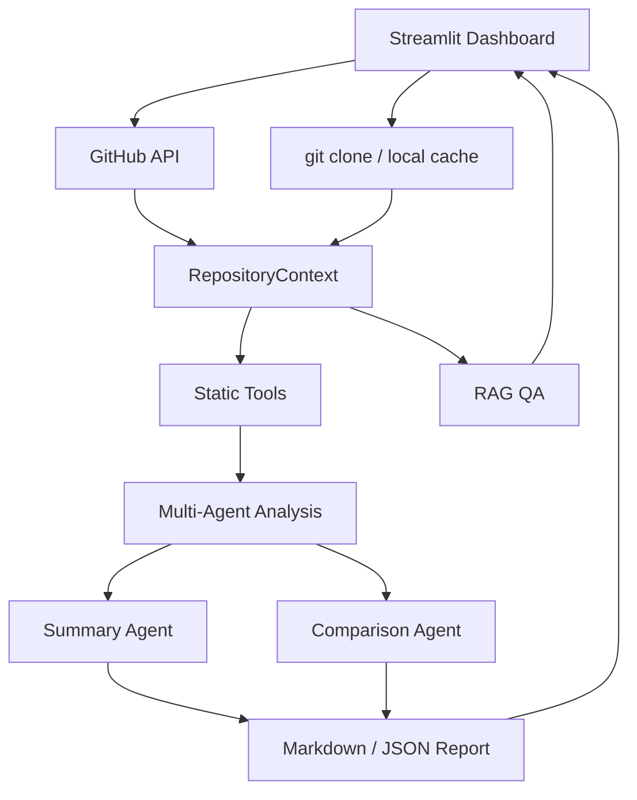

# GitHub 仓库智能分析器

一个面向课程设计答辩的 Streamlit Web Dashboard。用户输入 GitHub 仓库 URL 后，系统会自动获取仓库信息、克隆或读取缓存仓库，构建 `RepositoryContext`，再通过“规则工具 + LLM Agent”的混合式多 Agent 架构，从项目概览、技术栈、架构、代码质量、文档、测试部署和风险等维度生成结构化报告。

本项目不是把整个仓库直接丢给 LLM 总结。规则工具负责提取客观事实和指标，Agent 基于证据输出结构化 JSON，Ollama 只接收 README 摘要、文件结构摘要、依赖信息、Agent 结果等受控上下文。

## 功能特点

- 单仓库分析：输入一个 GitHub URL，输出 10 个维度的分析报告。
- 双仓库对比：输入两个 GitHub URL，分别分析后由 Comparison Agent 横向对比。
- 混合式 Agent：Overview、Tech Stack、Architecture、Summary、Comparison Agent 可调用 Ollama；质量、风险、测试部署 Agent 主要使用规则分析。
- GitHub API：获取仓库元数据、README 摘要和远程文件树，API 限流时自动降级到本地 clone 分析。
- 静态分析：文件树、文件类型、语言占比、依赖文件、代码行数、Python AST、TODO、长函数、长文件、文档完整性、部署文件和风险信号。
- Dashboard 展示：指标卡、文件树、技术栈标签、质量评分雷达图、维度评分表、风险列表、Agent 日志和报告下载。
- RAG 问答：基于 README、配置文件和源码片段回答仓库相关问题，并尽量给出证据路径。
- 无 LLM 模式：Ollama 不可用或用户关闭 Ollama 时，系统仍能输出规则分析和模板报告。

## 混合式 Agent 架构

本项目采用“规则工具 + LLM Agent”的分层架构：



规则工具负责：

- 文件树、目录结构、文件类型、代码行数和语言占比。
- 依赖文件、依赖版本、包管理工具、配置文件和部署文件。
- Python AST 统计函数数量、类数量、函数长度和长函数。
- README、LICENSE、安装运行说明、示例、API 文档和 docs 目录检查。
- `.env`、疑似凭据、SQL 拼接、bare except、大文件、缓存目录等风险信号。

LLM Agent 负责：

- Overview Agent：调用 Ollama，基于 README 摘要、GitHub 元数据、文件结构和入口候选判断项目用途、解决的问题、目标用户和项目类型。
- Tech Stack Agent：先用规则工具识别依赖、语言、import 和配置，再调用 Ollama 解释技术栈及依赖作用。
- Architecture Agent：先用文件树、入口文件和目录职责做规则判断，再调用 Ollama 基于结构化证据解释架构模式、模块划分和设计风险。
- Summary Agent：汇总所有 Agent 的结构化 JSON，调用 Ollama 生成最终自然语言报告，同时保留规则生成的 10 维度评分。
- Comparison Agent：先用规则方式生成两个仓库的 10 维度对比表，再调用 Ollama 生成综合对比结论和适用场景建议。

规则型 Agent 负责：

- Code Quality Agent：使用 AST、函数长度、长文件、TODO、测试线索等规则分析。
- Document Agent：检查 README、安装、运行、示例、API 文档和 docs 信号。
- Risk Agent：基于规则扫描敏感信息、依赖健康度和工程规范风险，不虚构 CVE。
- Test Deploy Agent：检测测试目录、测试框架、CI/CD、Docker、环境变量示例和启动脚本。

## 10 个分析维度

单仓库报告和双仓库对比报告都覆盖：

1. 项目概览：用途、解决的问题、目标用户、项目类型。
2. 技术栈识别：语言、框架、数据库、ORM、依赖、包管理工具。
3. 架构分析：结构模式、模块划分、入口文件、目录职责。
4. 代码规模：文件数、代码行数、语言占比、源码目录、测试和配置数量。
5. 代码质量：函数长度、文件长度、复杂度近似、TODO、异常处理信号。
6. 文档完整性：README、安装、运行、配置、示例、API、部署说明和 docs 目录。
7. 依赖健康度：依赖数量、版本固定、依赖文件规范、开发/运行依赖区分。
8. 测试覆盖：测试目录、测试文件、测试框架、测试文件占比和 CI 测试命令信号。
9. 部署方式：Dockerfile、docker-compose、GitHub Actions、环境变量示例、部署说明。
10. 潜在问题：硬编码、敏感信息、SQL 拼接、未处理异常、缺少测试和文档等。

## 项目结构

```text
github-repo-analyzer/
├─ app.py
├─ README.md
├─ requirements.txt
├─ .gitignore
├─ src/
│  ├─ analysis_models.py
│  ├─ context_builder.py
│  ├─ orchestrator.py
│  ├─ llm_client.py
│  ├─ llm_reporter.py
│  ├─ report_generator.py
│  ├─ github_api_client.py
│  ├─ repo_loader.py
│  ├─ file_tree.py
│  ├─ tech_stack_detector.py
│  ├─ architecture_analyzer.py
│  ├─ code_quality_analyzer.py
│  ├─ doc_checker.py
│  ├─ dependency_checker.py
│  ├─ deploy_detector.py
│  ├─ security_scanner.py
│  ├─ test_detector.py
│  ├─ rag_qa.py
│  └─ agents/
│     ├─ overview_agent.py
│     ├─ architecture_agent.py
│     ├─ tech_stack_agent.py
│     ├─ code_quality_agent.py
│     ├─ documentation_agent.py
│     ├─ test_deploy_agent.py
│     ├─ risk_agent.py
│     ├─ summary_agent.py
│     └─ comparison_agent.py
├─ data/analyzed_repos/
├─ outputs/
│  ├─ reports/
│  ├─ json/
│  └─ agent_logs/
├─ tests/
└─ docs/
```

## 安装与运行

建议使用 Python 3.10+。

```bash
pip install -r requirements.txt
streamlit run app.py
```

启用 Ollama：

```bash
ollama pull qwen2.5:7b
ollama serve
```

如果本机只有小模型，也可以在页面模型输入框中使用：

```text
qwen2.5:1.5b
```

GitHub API 未认证时可能触发限流。可选设置：

```powershell
$env:GITHUB_TOKEN="你的 GitHub token"
streamlit run app.py
```

不要把 token 写入代码、README、`.env` 或提交到 GitHub。

## 演示流程

单仓库分析：

1. 打开“单仓库分析”。
2. 输入公开仓库 URL，例如 `https://github.com/pallets/flask`。
3. 点击“开始分析”。
4. 观察进度：GitHub API、仓库获取、Context 构建、各 Agent 分析、Summary Agent 生成报告。
5. 展示项目概览、技术栈、文件树、风险检测、10 维度评分和 Agent 日志。
6. 下载 Markdown / JSON 报告。

双仓库对比：

1. 打开“双仓库对比”。
2. 输入两个仓库 URL，例如 `pallets/flask` 与 `fastapi/fastapi`。
3. 点击“开始对比”。
4. 系统分别执行单仓库分析，再由 Comparison Agent 输出横向对比。
5. 展示维度对比表、雷达图、技术栈差异、架构差异、风险差异和适用场景建议。

RAG 问答：

1. 先完成一次单仓库分析。
2. 打开“仓库代码问答”。
3. 输入问题，例如“这个项目怎么本地运行？”或“数据库模型有哪些？”。
4. 系统检索 README、配置和源码片段，启用 Ollama 时生成回答，并展示来源路径。

## 报告输出

生成文件保存在：

- `outputs/reports/`：Markdown 报告。
- `outputs/json/`：结构化 JSON 报告。
- `outputs/agent_logs/`：Agent 协作日志。

这些运行产物默认不会提交到 Git，只保留 `.gitkeep`。

## 测试

```bash
python -B -m pytest tests -q --basetemp .pytest_tmp -p no:cacheprovider
```

建议运行 `pytest tests` 或上面的命令；项目根目录的 `pytest.ini` 已将测试收集范围限制到 `tests/`，避免扫描 `data/analyzed_repos/` 中已分析仓库的第三方测试。

当前测试包含：

- GitHub URL 解析。
- GitHub API 限流降级。
- 代码质量测试目录识别。
- 10 维度契约。
- Comparison Agent 对比逻辑。
- 单仓库分析 smoke test。
- 双仓库对比 smoke test。

## 答辩亮点

- 不是简单 LLM 总结，而是“静态规则工具先提取证据，LLM Agent 再做语义解释和报告生成”。
- Overview、Tech Stack、Architecture 与 Summary Agent 确实调用 Ollama 分析受控结构化摘要，符合题目对 LLM 分析的要求。
- Code Quality、Risk、Test Deploy 继续使用规则分析，保证可解释性，不伪造漏洞或覆盖率。
- 所有 Agent 输出结构化 JSON，并记录 evidence、tools_used、llm_used、elapsed_seconds 和 status。
- Ollama 不可用时自动降级，课程演示不依赖外部服务稳定性。
- 支持双仓库对比和 RAG 问答，展示 Multi-Agent、Prompt Engineering、RAG、结构化输出和工程实践。
