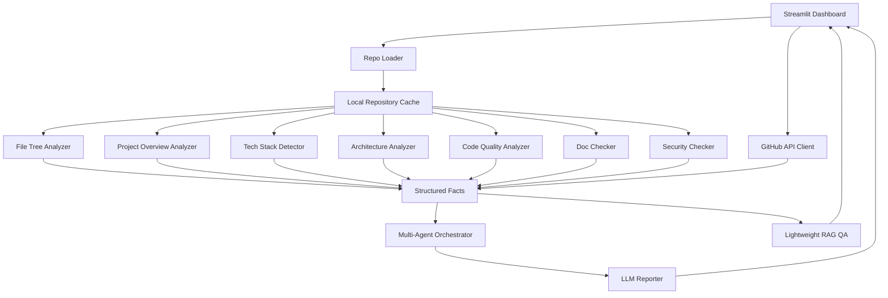

# GitHub 仓库智能分析器架构设计

## 设计目标

本项目的核心目标是把“陌生仓库理解”拆成可解释、可验证、可展示的工程流程。系统不直接把仓库丢给 LLM，而是先通过 GitHub API 和本地静态分析得到结构化事实，再通过 Multi-Agent 汇总、RAG 问答和 LLM 报告生成完成产品化呈现。

## 总体架构

## 模块职责

| 模块 | 文件 | 职责 |
| --- | --- | --- |
| GitHub API Client | `src/github_api_client.py` | 获取仓库元信息、README 摘要和远程文件树统计 |
| Repo Loader | `src/repo_loader.py` | 解析 URL、克隆仓库、复用缓存、处理克隆失败 |
| Project Overview Analyzer | `src/project_overview_analyzer.py` | 从 GitHub 描述、README、元信息和技术栈中提取项目用途、类型、目标用户和证据 |
| File Tree Analyzer | `src/file_tree.py` | 统计文件、目录、代码行数、语言行数、文件类别和文件树 |
| Tech Stack Detector | `src/tech_stack_detector.py` | 基于依赖文件、配置文件和后缀识别语言、框架、依赖版本和工具 |
| Architecture Analyzer | `src/architecture_analyzer.py` | 根据目录、入口、框架和 Docker Compose 信号识别架构模式 |
| Code Quality Analyzer | `src/code_quality_analyzer.py` | 使用 Python AST 统计函数、类、长函数、长文件、TODO 和测试 |
| Doc Checker | `src/doc_checker.py` | 检查 README、安装、运行、示例、LICENSE、依赖文件和 `.gitignore` |
| Security Checker | `src/security_checker.py` | 检查 `.env`、疑似凭据、虚拟环境、缓存目录和大文件 |
| Agent Orchestrator | `src/agent_orchestrator.py` | 组织架构、技术栈、质量、文档和汇总 Agent 的结构化输出 |
| RAG QA | `src/rag_qa.py` | 检索 README/配置/代码片段，并回答仓库相关问题 |
| LLM Reporter | `src/llm_reporter.py` | 调用 Ollama 生成 Markdown 报告，失败时退化为模板报告 |
| Report Exporter | `src/report_exporter.py` | 保存 Markdown 报告到 `reports/` |

## Multi-Agent 设计

本项目采用“逻辑 Agent”方式实现课程中的 Multi-Agent 思想。每个 Agent 接收不同维度的结构化输入，输出 JSON，而不是直接读取整个仓库。

| Agent | 输入 | 输出 |
| --- | --- | --- |
| 架构分析 Agent | 文件结构、入口文件、框架、工具 | 架构模式、置信度、模块划分、判断依据 |
| 技术栈 Agent | 依赖配置、后缀统计、GitHub API 语言 | 语言、框架、依赖、版本、工程工具 |
| 代码质量 Agent | AST 指标、长函数、TODO、测试目录 | 质量评分、问题列表、测试情况 |
| 文档 Agent | README 检查、LICENSE、依赖文件 | 文档评分、检查项、改进建议 |
| 汇总 Agent | 以上 Agent 输出 | 项目类型、核心发现、风险摘要 |

项目用途分析不依赖 LLM。系统会优先使用 GitHub API description 和包元信息，其次使用 README 标题与开头段落，再结合 topics、框架和目录结构推断项目类型。Dashboard 会展示置信度和证据来源，避免用户输入链接后仍不知道仓库是做什么的。

Dashboard 会展示每个 Agent 的输入摘要、输出 JSON、耗时和 token 估算，方便答辩说明“协作过程”。

## RAG 问答设计

RAG 问答模块不会把整个仓库提交给 LLM，而是：

1. 遍历 README、配置文件和代码文件，按行分块。
2. 对用户问题做关键词切分。
3. 用词项重叠和路径权重检索最相关片段。
4. 对常见问题使用确定性启发式回答，例如：
   - “数据库模型有哪些”：使用 Python AST 查找 SQLAlchemy/Django/SQLModel 风格模型类。
   - “怎么在本地跑起来”：结合 README、依赖文件、框架和环境变量引用生成运行步骤。
5. 如果 Ollama 可用，只把 Top-K 片段和仓库摘要发给模型生成回答。

该设计满足 RAG 的“检索增强”思想，同时避免上传完整仓库。

## Prompt Engineering

报告生成 Prompt 的关键约束：

- 只能依据结构化静态分析结果。
- 不要假设看过完整源码。
- 必须结合评分、风险、扣分原因和 Agent 输出。
- 输出适合课程设计答辩展示的中文 Markdown。

RAG 问答 Prompt 的关键约束：

- 只能根据仓库摘要和检索片段回答。
- 不允许编造未出现的文件、函数或配置。
- 涉及具体信息时标注来源文件。

## 失败与退化策略

| 失败场景 | 处理方式 |
| --- | --- |
| GitHub API 不可用 | 显示 API 错误，但继续本地 clone 分析 |
| git clone 失败 | 页面给出友好错误，提示检查 URL、网络和权限 |
| Ollama 未启动 | 自动退化为模板报告 |
| 模型未安装 | 页面显示可用模型，并提示 `ollama pull` 命令 |
| 仓库过大 | 忽略常见大目录，限制读取大文件，RAG 只检索文本片段 |
| 代码非 Python | 仍做结构、技术栈、文档和安全分析；AST 质量指标会较少 |

## 可扩展方向

- 使用 ChromaDB 替换当前轻量检索，实现向量 RAG。
- 接入 Ruff、Radon、Bandit、Semgrep 增强质量和安全检查。
- 增加 JavaScript/TypeScript、Java、Go 的 AST 或语法树分析。
- 增加 Git 历史分析、贡献者分析和热点文件分析。
- 增加两个仓库对比功能。
- 增加异步任务队列，支持大型仓库长时间分析。
