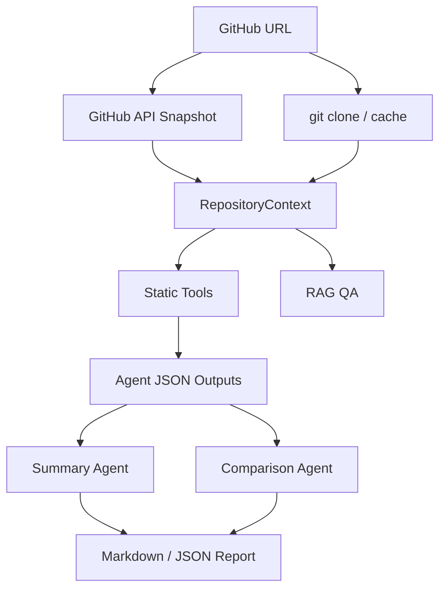

# 设计说明：规则工具 + LLM Agent 混合架构

## 为什么不能直接把仓库丢给 LLM

陌生 GitHub 仓库通常包含大量源码、依赖文件、测试、文档、二进制资源和构建产物。直接把整个仓库交给 LLM 会带来几个问题：

- 上下文长度不够，模型无法完整读取大型仓库。
- 统计指标不可靠，例如文件数、代码行数、长函数数量、测试文件数量。
- 容易产生幻觉，例如编造技术栈版本、测试覆盖率或安全漏洞。
- 证据链不清晰，答辩时难以解释评分依据。
- 可能误读 `.env`、密钥、二进制文件或无关缓存文件。

因此本项目采用分层方案：先由规则工具提取事实，再由 Agent 基于事实和 evidence 做判断。

## 总体流程

`RepositoryContext` 会收集：

- `repo_name / owner / url / local_path`
- README 原文与摘要
- 文件树摘要
- 依赖文件内容
- 源码样本
- 测试文件、配置文件、部署文件
- 语言统计、代码指标、import 摘要
- 入口文件候选

## Agent 分工

| Agent | 是否调用 Ollama | 核心职责 |
| --- | --- | --- |
| Overview Agent | 是 | 基于 README、GitHub 元数据、文件结构和入口文件判断项目用途、目标用户和项目类型 |
| Tech Stack Agent | 是 | 先用规则提取依赖、语言、import 和配置，再由 LLM 解释技术栈 |
| Architecture Agent | 否 | 基于文件树、目录命名、入口文件和技术栈判断架构模式 |
| Code Quality Agent | 否 | 使用 Python AST 和规则统计长函数、长文件、TODO、测试线索 |
| Document Agent | 否 | 检查 README、安装、运行、示例、API 文档和 docs 目录 |
| Test Deploy Agent | 否 | 检查 tests、测试框架、CI/CD、Docker、环境变量示例和启动脚本 |
| Risk Agent | 否 | 规则扫描敏感信息、SQL 拼接、bare except、依赖规范和工程风险 |
| Summary Agent | 是 | 汇总所有 Agent JSON，生成最终报告，但保留规则评分表 |
| Comparison Agent | 是 | 先规则对比两个仓库 10 维度评分，再用 LLM 生成综合结论 |

## LLM 调用边界

本项目新增 `src/llm_client.py` 统一封装 Ollama：

- 默认模型：`qwen2.5:7b`
- 默认地址：`http://localhost:11434`
- 支持 JSON 输出解析
- JSON 解析失败时自动重试一次
- Ollama 不可用时返回 fallback，不让项目崩溃
- 日志记录 `llm_used`、`model`、`prompt_length`、`status`、`error_message`

LLM 只接收受控上下文：

- README 摘要，而非完整仓库。
- 文件树片段，而非所有文件内容。
- 依赖文件摘要和 import 摘要。
- 各 Agent 的结构化 JSON。
- RAG 检索到的 Top-K 片段。

## 防幻觉策略

- 所有 Agent 输出必须包含 `evidence`。
- 如果无法判断数据库、框架或项目用途，输出“不确定”。
- 不伪造 CVE、漏洞编号、测试覆盖率或依赖最新版本。
- Code Quality、Risk、Test Deploy 维度使用规则分析，不让 LLM 猜安全问题。
- Summary Agent 只做整合和表达，不重新替代其他 Agent 做细节分析。

## Agent 日志

`outputs/agent_logs/` 中的日志包含：

- `agent_name`
- `input_summary`
- `tools_used`
- `llm_used`
- `model`
- `output_summary`
- `evidence_count`
- `score`
- `elapsed_seconds`
- `status`
- `error_message`

答辩时可以展示 Overview Agent 和 Tech Stack Agent 的日志，证明它们确实调用了 Ollama；也可以展示 Code Quality 和 Risk Agent 的日志，说明它们保持规则分析和可解释评分。

## 降级机制

| 场景 | 处理方式 |
| --- | --- |
| GitHub API 限流 | 显示友好提示，继续使用 clone 后的本地分析 |
| git clone 失败 | 提示检查 URL、网络和仓库权限 |
| Ollama 未启动 | Agent 使用 fallback 规则结果，报告仍可生成 |
| 模型未安装 | 页面可选择已有模型，或提示 `ollama pull qwen2.5:7b` |
| LLM 输出不是 JSON | 自动重试一次，失败后使用规则结果 |
| 仓库过大 | 忽略大目录，源码抽样，文件内容限长 |
| 非 Python 仓库 | 仍做文件结构、技术栈、文档、测试部署和风险分析 |

## 课程知识点对应

- Multi-Agent：多个 Agent 按维度协作，日志可追踪。
- Prompt Engineering：要求 LLM 返回严格 JSON，并限制只能基于 evidence。
- RAG：问答模块检索 README、配置和源码片段后回答。
- 结构化输出：AgentResult、RepositoryContext、ComparisonResult 都是结构化数据。
- 工程实践：模块化代码、测试、降级、`.gitignore`、报告导出和 Dashboard 产品化展示。

