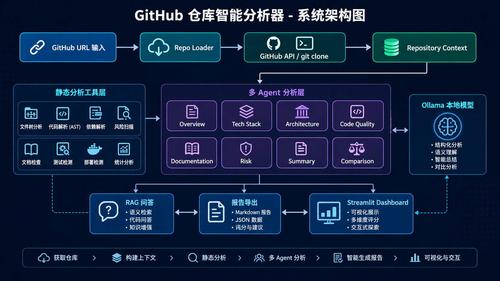

# GitHub 仓库智能分析器课程设计报告

## 一、选题背景与目标

在实际开发中，理解一个陌生 GitHub 仓库通常不是只看 README 就能完成的。开发者需要同时关注项目用途、目录结构、依赖文件、入口文件、测试目录、部署配置、文档完整性和潜在安全风险。如果仓库规模较大，人工阅读会消耗较多时间；如果直接把仓库链接交给大模型总结，模型又很难准确统计文件数量、代码行数、长函数、依赖版本和测试情况，也容易产生缺少证据的判断。

本项目实现了一个可本地运行的 GitHub 仓库智能分析 Web 应用。用户输入 GitHub 仓库 URL 后，系统自动通过 GitHub API 获取仓库元信息和 README，并使用 `git clone` 获取本地代码，再从项目概览、技术栈、架构、代码规模、代码质量、文档完整性、依赖健康度、测试覆盖、部署方式和潜在问题十个维度生成结构化报告。

项目目标可以概括为三点：第一，帮助开发者快速判断一个仓库是做什么的、是否值得继续阅读；第二，用可复现的静态指标辅助评估代码质量、文档和工程规范；第三，通过多 Agent、RAG 问答、Agent 日志和双仓库对比，让分析过程可追踪、可解释，而不是只输出一段大模型总结文本。

## 二、相关技术介绍

本项目使用 GitHub API 与 `git clone` 结合的方式获取仓库信息。GitHub API 适合获取仓库描述、默认分支、stars、forks、topics、license、README 和远程文件树；本地 clone 则适合进行 AST 分析、依赖读取、安全扫描和 RAG 片段检索。两者结合可以同时满足“快速获取元信息”和“深度静态分析”的需求。

Ollama 用于本地大模型调用。项目默认模型为 `qwen2.5:7b`，页面中可以切换为本机已有模型，实际日志中也验证过 `qwen2.5-coder:7b`。`llm_client.py` 封装了 `/api/generate`，提供 `generate_json` 和 `generate_text` 两类接口。模型不可用、模型未安装或 JSON 解析失败时，系统会自动返回 fallback，保证核心流程不会被 LLM 服务中断。

提示工程主要体现在输入边界控制上。项目不会把完整仓库源码直接交给 LLM，而是把 README 摘要、文件结构摘要、依赖信息、静态分析结果和 Agent 输出整理为结构化 JSON，再让 LLM 基于这些证据生成解释。这样可以减少幻觉，也方便在 Dashboard 中展示证据来源。

RAG 问答模块用于回答“怎么本地运行”“数据库模型有哪些”“入口文件在哪里”等仓库相关问题。系统先检索 README、配置文件和代码片段，再把最相关片段交给规则模板或 Ollama 回答。当前实现是轻量级关键词检索和启发式分析，没有引入 ChromaDB，但已经体现了“先检索证据，再生成回答”的思想。

多 Agent 是项目的核心组织方式。Overview、Tech Stack、Architecture、Summary 和 Comparison Agent 可以调用 Ollama 做语义解释；Code Quality、Documentation、Test Deploy 和 Risk Agent 主要使用规则分析，保证评分可解释。每个 Agent 都输出统一的 `AgentResult`，包含 summary、findings、evidence、score、suggestions、confidence、tools_used、llm_used 和 status。

结合课程内容，本项目与各模块的关系如下：

| 课程模块 | 项目对应实现 |
| --- | --- |
| 深度学习框架与工程实践 | 使用模块化 Python 工程、测试、`.gitignore`、报告导出和 Streamlit Dashboard |
| Transformer 架构与大模型基础 | 通过 Ollama 调用 Qwen 系列本地大模型，理解其上下文限制和生成不稳定性 |
| 提示工程与 LangChain 应用开发 | 通过 prompt 限制 LLM 只能基于结构化证据输出；未引入 LangChain，采用轻量封装降低复杂度 |
| RAG 架构详解与实践 | 对 README、配置和代码片段进行检索增强问答 |
| 智能体与多智能体系统 | 多个 Agent 按分析维度协作，Summary Agent 统一汇总 |
| 评估、优化与部署 | 使用 pytest、py_compile、Agent 日志、fallback、缓存目录和报告导出验证系统可用性 |
| 企业级综合项目实战 | 形成完整 Web Dashboard，具备输入、分析、展示、问答、对比和导出闭环 |

## 三、系统设计

系统主流程为：用户输入 GitHub URL，`github_api_client.py` 获取 API 快照，`repo_loader.py` 克隆或读取缓存仓库，`context_builder.py` 构建统一的 `RepositoryContext`，静态工具提取文件结构、依赖、质量、文档、测试、部署和风险证据，多 Agent 分维度分析，Summary Agent 生成报告，最后由 Streamlit Dashboard 展示并支持导出。



图 1 展示了系统从 GitHub URL 输入到可视化报告输出的完整流程。仓库获取阶段同时使用 GitHub API 和本地 clone，随后由 RepositoryContext 统一整理 README、依赖、文件结构和代码抽样；静态分析工具层提取确定性证据，多 Agent 分析层在证据基础上完成概览、技术栈、架构、质量、文档、风险、汇总和对比分析；最终结果进入 Streamlit Dashboard，并支持 RAG 问答和 Markdown / JSON 报告导出。

模块划分如下：

| 模块 | 主要文件 | 作用 |
| --- | --- | --- |
| 仓库获取 | `repo_loader.py`, `github_api_client.py` | 解析 URL、调用 GitHub API、克隆仓库、处理缓存 |
| 上下文构建 | `context_builder.py`, `analysis_models.py` | 收集 README、依赖、源码样本、测试、部署和入口候选 |
| 静态分析工具 | `file_tree.py`, `tech_stack_detector.py`, `code_quality_analyzer.py` 等 | 输出可复现的事实和指标 |
| 多 Agent 层 | `src/agents/*.py` | 按维度组织分析，输出统一 `AgentResult` |
| LLM 调用 | `llm_client.py`, `llm_reporter.py` | 调用 Ollama，失败时自动降级 |
| RAG 问答 | `rag_qa.py` | 检索 README、配置和代码片段后回答问题 |
| 前端展示 | `app.py` | Streamlit Dashboard、进度条、图表、日志、问答和导出 |

系统采用“规则工具 + LLM Agent”的混合架构。规则工具负责准确统计和风险扫描，例如文件数、代码行数、AST 函数数量、README 检查项和敏感字符串；LLM Agent 负责语义解释和报告表达，例如项目用途、技术栈含义、架构说明和对比建议。这样既能利用大模型的语言理解能力，又不会让模型承担精确统计和安全扫描这类更适合程序完成的任务。

## 四、关键实现细节

### 1. 分析编排流程

`orchestrator.py` 是系统主流程入口。它先获取 GitHub API 信息，再克隆或读取缓存仓库，之后构建 `RepositoryContext` 并依次执行各个 Agent。

```python
def analyze_repository(
    repo_url: str,
    base_dir: Path,
    refresh: bool = False,
    use_llm: bool = True,
    model: str = DEFAULT_MODEL,
    ollama_base_url: str = DEFAULT_BASE_URL,
    progress: ProgressFn | None = None,
) -> dict[str, Any]:
    _progress(progress, "通过 GitHub API 获取仓库信息、README 和远程文件树", 8)
    github_api = fetch_github_api_snapshot(repo_url)

    _progress(progress, "克隆仓库或读取本地缓存", 18)
    repo_info = clone_or_use_cache(repo_url, base_dir, refresh=refresh).to_dict()

    _progress(progress, "构建 RepositoryContext：README、依赖、测试、部署和源码抽样", 28)
    context = build_repository_context(repo_info, github_api)
```

这段代码体现了系统不是一次性把 URL 发给 LLM，而是按“API 获取、仓库加载、上下文构建、Agent 分析”的顺序执行。页面进度条也对应这些阶段，便于用户感知分析过程。

### 2. Agent 统一输出结构

所有 Agent 都返回 `AgentResult`。这样前端、日志、报告导出和测试可以使用同一套字段读取分析结果。

```python
@dataclass
class AgentResult:
    agent_name: str
    summary: str
    findings: list[str]
    evidence: list[dict[str, Any]]
    score: float
    suggestions: list[str]
    confidence: str
    raw_output: dict[str, Any] = field(default_factory=dict)
    llm_used: bool = False
    tools_used: list[str] = field(default_factory=list)
    elapsed_seconds: float = 0.0
    status: str = "done"
    error_message: str = ""
```

这个结构解决了两个问题：一是每个 Agent 的输出不会变成散乱文本，二是能够记录 evidence、tools_used 和 llm_used，说明结论来自规则工具还是 Ollama。

### 3. Ollama JSON 调用与降级

LLM 输出不稳定是项目中的关键风险，因此 `generate_json` 做了模型检查、禁用处理、JSON 解析失败重试和 fallback。

```python
def generate_json(self, system_prompt: str, user_prompt: str,
                  fallback: dict[str, Any] | None = None) -> dict[str, Any]:
    fallback_payload = dict(fallback or {})
    prompt = _json_prompt(system_prompt, user_prompt)
    base_log = self._base_log(prompt)
    if not self.enabled:
        self.last_call_log = {
            **base_log,
            "status": "disabled",
            "error_message": "LLM disabled by user option.",
        }
        return self._with_meta(fallback_payload, self.last_call_log)
```

当 Ollama 未启动、模型不存在或返回内容不是 JSON 时，系统不会中断，而是使用规则结果继续生成报告。这一点对本地运行和课堂展示都很重要。

### 4. Python AST 与代码质量分析

代码质量 Agent 使用 AST 统计函数、类、平均函数长度、长函数和解析错误。相比直接按文本搜索，AST 能更准确地区分函数、类和代码结构。

```python
for node in ast.walk(tree):
    if not isinstance(node, ast.ClassDef):
        continue
    fields = []
    for item in node.body:
        if isinstance(item, ast.AnnAssign) and isinstance(item.target, ast.Name):
            fields.append(item.target.id)
        elif isinstance(item, ast.Assign):
            for target in item.targets:
                if isinstance(target, ast.Name):
                    fields.append(target.id)
```

上面片段来自 RAG 问答中的模型类识别逻辑。系统通过 AST 查找类定义和字段，用于回答“数据库模型有哪些”这类问题。代码质量模块也采用类似思路统计函数和类。

### 5. RAG 问答设计

RAG 模块不会把整个仓库直接发给 LLM，而是先从 README、配置文件和源码样本中检索相关片段。对于常见问题，系统还加入启发式规则，例如本地运行步骤、入口文件和模型类识别。这样即使 Ollama 不可用，也能基于检索结果给出基础回答。

### 6. Streamlit Dashboard 交互

前端使用 Streamlit 的 `columns`、`container`、`metric`、`expander` 和 Plotly 图表构建 Dashboard。页面包括顶部 URL 输入、分析按钮、进度条、三栏结果区、Agent 日志、RAG 问答、双仓库对比和报告导出。按钮在分析中会禁用并显示状态，避免重复触发任务；文件树和风险区域采用单向滚动，降低页面拥挤感。

## 五、实验与评估

项目使用真实公开仓库进行了本地验证，包括 `pallets/flask`、`encode/starlette`、`streamlit/streamlit-hello`、`pypa/sampleproject`、`pallets/itsdangerous` 和 `pallets/click` 等。不同仓库规模和工程风格差异较大，可以观察系统在小型示例仓库、Python 库项目、Web 框架项目和 CLI 工具项目上的表现。

以 Flask 仓库为例，本地日志显示 Tech Stack、Architecture、Overview 和 Summary Agent 成功调用 `qwen2.5-coder:7b`；Code Quality、Documentation、Test Deploy 和 Risk Agent 使用规则分析。日志中保留了 `llm_used`、`model`、`status`、`score`、`evidence_count` 和 `tools_used`，能够证明每个 Agent 都有明确输入和输出。

双仓库对比使用 Flask 与 Starlette 进行测试。系统先分别执行单仓库分析，再由 Comparison Agent 汇总两个结果，输出十维度对比表、雷达图、技术栈差异、架构差异和适用场景建议。项目曾遇到 LLM 返回字符串列表导致雷达图报错的问题，后续通过结果归一化处理解决，避免模型输出格式异常破坏页面。

自动化测试方面，项目包含 URL 解析、GitHub API 限流、缓存删除、代码质量测试识别、十维度契约、Summary Agent、Architecture Agent、Comparison Agent 容错、单仓库 smoke 和双仓库 smoke 等测试。`pytest.ini` 将测试范围限制在 `tests/`，避免扫描 `data/analyzed_repos/` 中缓存的第三方仓库。最近一次本地验证结果为 `pytest tests` 通过 15 个测试。

从结果看，系统在 Python 项目、常见 Web 框架、标准库式工程和带 CI/CD 的仓库上表现较稳定。对于 README 较少、文档集中在 `docs/`、非 Python 语言或大型 monorepo 的仓库，评分可能存在偏差，需要结合人工判断。这说明当前系统适合作为仓库理解和初步评估工具，而不是替代完整 code review。

## 六、遇到的问题与解决方案

| 问题 | 原因 | 解决方案 |
| --- | --- | --- |
| Ollama 不可用或模型不存在 | 本地服务未启动，或未安装默认模型 | 增加 `available_models` 检查和模板报告 fallback |
| GitHub API 403 限流 | 未配置 token 或请求频繁 | API 失败时继续使用本地 clone 分析，并在页面提示 |
| LLM 返回非标准 JSON | 模型输出自然语言或字符串列表 | `generate_json` 解析失败后重试，前端和 Agent 对结果做归一化 |
| pytest 扫描缓存仓库 | `data/analyzed_repos` 下存在第三方测试 | 通过 `pytest.ini` 设置 `testpaths = tests` 并排除缓存目录 |
| Windows 删除 `.git` pack 文件失败 | Git 进程或只读文件占用 | 仓库加载模块改为更温和的缓存复用和错误提示 |
| 页面右侧过满、文件树难读 | 初版页面把大量文本直接展开 | 改为三栏 Dashboard、滚动文件树、风险列表和 expander |

这些问题说明，工程项目不只需要实现主路径，还需要处理本地环境、网络限制、模型不稳定、文件权限和页面体验等边界情况。

## 七、总结与心得

本项目完成了一个可运行的 GitHub 仓库智能分析 Dashboard，支持单仓库分析、双仓库对比、十维度评分、RAG 问答、Agent 日志和 Markdown / JSON 报告导出。系统设计上没有直接把完整仓库交给 LLM，而是先通过规则工具提取证据，再由 LLM Agent 基于受控上下文做语义解释和报告生成。

开发过程中最大的体会是，大模型更适合做解释、归纳和建议，不适合承担精确统计和安全扫描。文件数量、函数长度、依赖列表、测试目录和风险信号应由程序确定性分析；项目用途、技术栈含义、架构说明和新人上手建议则可以交给 LLM 在证据基础上生成。这个分工让系统既有智能性，也保留了可解释性。

另一个体会是，评估和降级机制非常重要。GitHub API 可能限流，Ollama 可能未启动，LLM 输出可能不符合 JSON，Windows 文件权限也可能导致缓存删除失败。如果没有 fallback、日志和测试，系统很容易只在理想环境中可用。通过 Agent 日志、pytest、py_compile 和页面状态提示，项目的可运行性和可展示性都有明显提升。

后续改进方向包括：接入真实漏洞库和安全工具，例如 OSV、pip-audit、npm audit、Bandit、Semgrep；增加 coverage 和 lint 结果；扩展 JavaScript、TypeScript、Java、Go 等语言的语法分析；为 LLM 输出加入严格 JSON Schema；使用 ChromaDB 替换当前轻量检索；增加历史报告管理和 Docker 部署文件。这样可以让系统从教学原型进一步演进为更完整的代码仓库分析工具。
